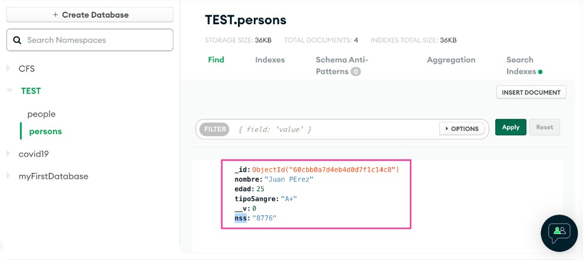

# Práctica 19: API Parte 2

> Segunda Parcial

- FACULTAD DE TELEMATICA
- INGENIERÍA EN SOFTWARE
- “4ºG”
- PROGRAMACIÓN WEB
- CATEDRATICO: ULIBARRI IRETA CARLOS
- AGUIRRE ROMERO RAMÓN ALEJANDRO

## OBJETIVO

En las prácticas anteriores hemos abordado tópicos que nos van a ayudar a construir nuestra RESTFUL API conectada a una fuente de datos de MongoDB. Para dar paso a este nuevo proyecto será necesario comenzar desde cero, tener un proyecto nuevo, debido a que la organización de los directorios y archivos es clave para el posterior mantenimiento de nuestros servicios.

En esta práctica, utilizaremos una parte del código de la práctica 16, práctica 17 y práctica 18.

> ENTREGA: DOMINGO 22 DE MAYO DEL 2022

## EXPLICACIÓN DEL PROCESO

1. Crea una carpeta llamada "practica_19"

2. Inicializa NPM con npm init -y

3. Instala el paquete “express” desde la línea de comando

4. Instala el paquete “ejs” desde la línea de comando (npm i ejs)

5. Instala el paquete “nodemon” desde la línea de comando (npm i nodemon)

6. Instala el paquete “mongoose” desde la línea de comando (npm i mongoose)

7. Crea una carpeta llamada “public”

8. Crea una carpeta llamada “models”

9. Crea una carpeta llamada “views”

10. Crea una carpeta llamada “routes”

11. En la raiz se crea un archivo server.js

12. Dentro de la carpeta routes se creara un archivo person.js

13. Dentro de la carpeta models se creara un archivo person.js

14. Se crean 3 rutas en el archivo person.js de la carpeta routes, en la ruta raiz se crea un vinculo el cual dirigira a dos posibles paginas una de un formulario y otra del listado de la coleccion

15. En el archivo person.js de models se inyecta la dependencia de mongoose, se instancia un nuevo Schema de Mongoose y se imposta una instancia de un modelo de mongoose.

16. En el archivo person.js de routes se crea un get en el cual recuperamos todos los documentos que estan en el mongodb contenidos en la coleccion y se regresan al html como un objeto json para eso se ocupa:

17. Inyectar express,generar una instancia, inyectar una depencdencia de mongoose y inyectar una dependencia para el model de person

18. Se exporta el router

19. En el archivo server.js se crea una dependencia para mongoose,express,personsRoutes

20. Se genera una app para mongoose para settear un valor y retomas el codigo realizado en server.js de la practica 16 y 17

21. En mongodb se crea un documento para que se pueda mandar llamar un objeto json

22. Ahora se ejecuta el comando "npx nodemon server" y acccede a http://localhost:3000/person

## RECURSOS

- https://www.npmjs.com/
- https://ejs.co/
